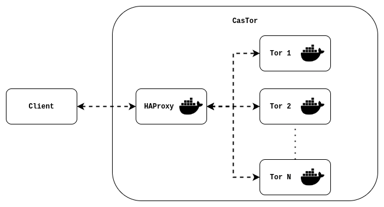

# CasTor :beaver:

Tor proxy with balanced Tor instances.



## Requirements

- [docker](https://docs.docker.com/engine/install/)
- [docker-compose](https://docs.docker.com/compose/install/)

## Usage

There are two ways to launch castor proxy:

- you can either use the castor script: [Castor script](#castor-script)

- or use dirrectly docker commands: [Docker compose](#docker)

### Castor script

The script [`castor.sh`](castor.sh) can be used to start the castor proxy.

#### Quickstart

Start a SOCKS5 proxy on port 8080:

```bash
bash castor.sh start
```

Stop the proxy:

```bash
bash castor.sh stop
```

#### Usage

```bash
Usage: castor.sh [OPTIONS] COMMAND

COMMANDS
    start
        starts castor
    stop
        stop castor

OPTIONS
    -h
        Display usage statement
    -p=int
        Port to run the proxy (default=8080)
    -m=socks|http
        Proxy mode, either SOCKS5 or HTTP CONNECT proxy (default=socks)
    -t=int
        Number of Tor instances to run (default=5)
```

#### Simplify script usage

##### Set an alias

To simplify the use of this script and simply call it with `castor`, you can set an alias such as (assuming you are in castor directory):

```bash
alias castor='bash $(pwd)/castor.sh'
```

This alias should be written in the `~/.bashrc` file to make it permanent:

```bash
echo "alias castor='bash $(pwd)/castor.sh'" >> ~/.bashrc
```

##### Add autocompletion

Once you setted an alias for the castor script, you can also add autocompletion for castor commands:

```bash
complete -W "start stop" castor
```

Once again to make the autocompletion permanent, you should add it in the `~/.bashrc` file:

```bash
echo "complete -W 'start stop' castor" >> ~/.bashrc
```

##### Simplified script usage

After setting an alias and autocompletion, the script can be used from anywhere simply as following:

```bash
castor [OPTIONS] COMMAND
```

For instance to start the proxy on port 1234 with 15 Tor instances:

```bash
castor -p 1234 -t 15 start
```

### Docker

The [castor script](castor.sh) simply calls docker-compose commands, so you can use docker-compose directly.

#### Quickstart

This command will start 5 Tor instance and HAProxy:

```bash
docker-compose up
```

By default the proxy will be a SOCKS5 proxy running on port **8080** (as specified in [`.env`](.env) file).

#### Start multiple Tor instances

Use the docker-compose scale option to set the number of Tor instance to start

For instance to start 10 Tor instances:

```bash
docker-compose up --scale tor=10
```

By default, 5 tor instances are started. This also can be tunned in [`docker-compose.yml`](docker-compose.yml) file by editing the `scale` parameter of tor service.

#### Use HTTP CONNECT proxy

Tor also provides an HTTP CONNECT proxy; you can use it by setting the environment variable `PROXY_MODE` to "http". This can be done by editing the [`.env`](.env) file or dirrectly in the shell such as:

```bash
export PROXY_MODE="http"
```

#### Run proxy on a different port

Proxy port can be set using the environement varaible `PROXY_PORT`. You can specify it in the [`.env`](.env) file or dirrectly in the shell such as:

```bash
export PROXY_PORT=8080
```

## Test the proxy

Once the application is started, you can test your proxy with `curl`:

```bash
# test without the proxy
$ curl https://ipinfo.io/ip
A.B.C.D     # => your current IP address

# test with the proxy (with the default proxy conf)
$ curl -x socks5://localhost:8080 https://ipinfo.io/ip
W.X.Y.Z     # => Tor exit node IP address
```

## How is it working ?

When you run the command `docker-compose up`, you start at least 3 services (more if you scaled up the number of Tor instances): **tor**, **conf-generator** and **haproxy**.

1. The first service started is **tor**, this service is running a Tor instance with a SOCKS5 proxy (and with a Tor HTTP Tunnel if you use the "http" mode).

2. The second service is **conf-generator**, this service runs a python script that does the following things:

   1. get all the IP address of the Tor instances within the docker network (using the Docker API)
   2. generate an HAProxy configuration file with the retrieved IPs and the proxy mode

3. The final service is an HAProxy load balancer using the configuration file generated by **conf-generator**.
